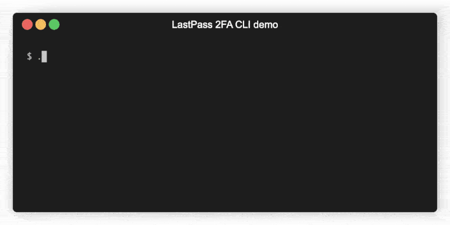

# LastPass 2FA CLI authenticator

This commandline tool can be used on Windows, MacOS and Linux systems to get a 2FA TOTP code from the console or terminal. The secrets are downloaded from [lastpass.com](https://lastpass.com) and stored safely in an encrypted file (default `vault.dat`).

## Quickstart

1. Put the executable (`2fa.exe` for windows, `2fa` for MacOs / Linux) and dependencies somewhere in your path.

   Either edit the `appsettings.json` file to point to a location where you want to store your MFA vault, or use the `-i` (or `--file`) option when invoking the command to specify where the vault is (to be) stored.

2. Download the vault

   `2fa download -u username@domain.com -o 123456`
   
   The `-o` or `--otp` option specifies the current OTP code (if any). Use `-i` or `--file` to specify a vault location when you want to override use the setting from `appsettings.json`.
   
   You will be asked for your LastPass master password (to be able to download the vault) and a password to use when encrypting your offline copy of the MFA vault so your data is secure. Confirm the vault password and wait for the vault to be downloaded.

3. From now on you can lookup 2fa codes:

    `2fa list`

    or, when you're looking for a specific entry:

    `2fa list -f <searchstring>`

    or, when you want to use specify the vault to use:

    `2fa list -i /path/to/vault.dat -f <searchstring>`

    You will be asked for the local vault password that was used to encrypt the vault in step 2 and will then be shown all accounts (`-f` or `--find` filters the results to `<searchstring>`) with the current TOTP code.

Whenever new 2FA codes are added to LastPass Authenticator, simply refresh your vault:

`2fa refresh -u username@domain.com -o 123456`

Note that the commands `download`, `refresh` and `update` are synonyms for the same action.

## Demo

## Credits

MFA vault download based on Donny Maasland's [Lastpass Authenticator Export](https://github.com/dmaasland/lastpass-authenticator-export).

## FAQ

**Q**: _Why can't I pass the password as an argument like `2fa list -f <searchstring> --password sup3rs3cr3t`?**_

**A**: Because that would store your password in your terminal's history which is a security risk. Also because it prevents using this tool non-interactively (which could be dangerous when some malicious code tries to run this tool unseen in the background).

**Q**: Isn't this terribly insecure?

**A**: It depends on your definition of 'terribly insecure'. The vault is named the vault for a reason; the secrets in it, and the entire vault actually, are encrypted with AES encryption. At no time is your master password or vault password stored. That's why it keeps asking for your password every time you want to get a code or download / refresh your vault. You will also be warned when your vault password is the same as your LastPass master password. Don't do that. Your master password should be used for one purpose only: protect your LastPass vault. The 'offline MFA backup' (i.e. your local vault) should be protected with a different password. Should a malicious actor get access to your system and be able to snatch a copy of your vault they won't be able to use it unless they also somehow gain access to your password. That's not impossible; keyloggers exist, phishing exists and there's probably another 45 ways your password can be exfiltrated. However, as long as you don't re-use passwords and take the normal precautions of keeping your system and antivirus up-to-date and make sure your vault is saved in a place where it's not easy to gain access to (don't save it in onedrive or gdrive or whatever, keep it offline!) you should be good. Oh, also: don't forget this shows your codes on-screen! So don't use this tool when streaming video of your desktop or in a meeting with screen-share etc.! And as always: USE AT YOUR OWN RISK.

## License

Licensed under MIT license. See [LICENSE](LICENSE) for details.

---

Icon made by [Freepik](http://www.flaticon.com/authors/freepik) from [www.flaticon.com](http://www.flaticon.com) is licensed by [CC 3.0](http://creativecommons.org/licenses/by/3.0/).